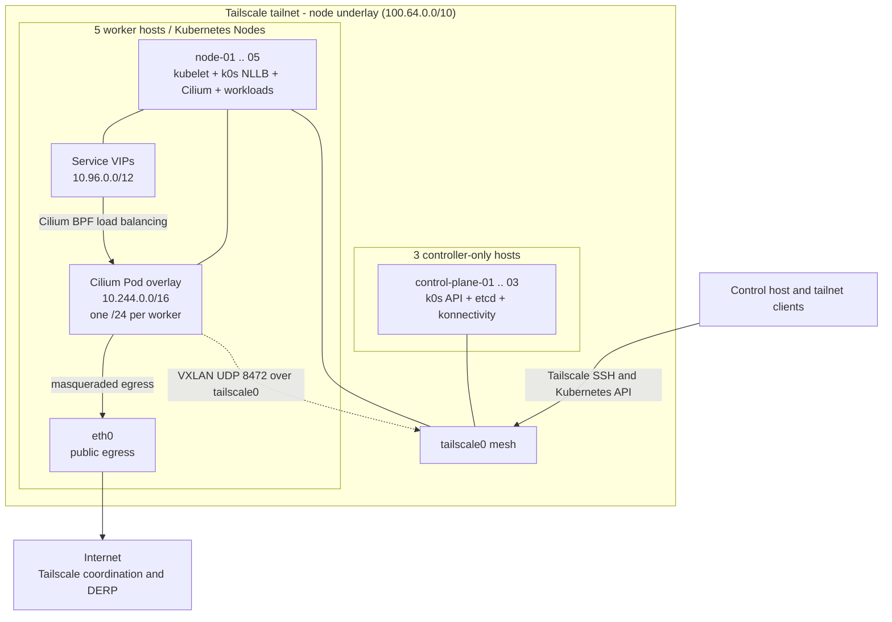
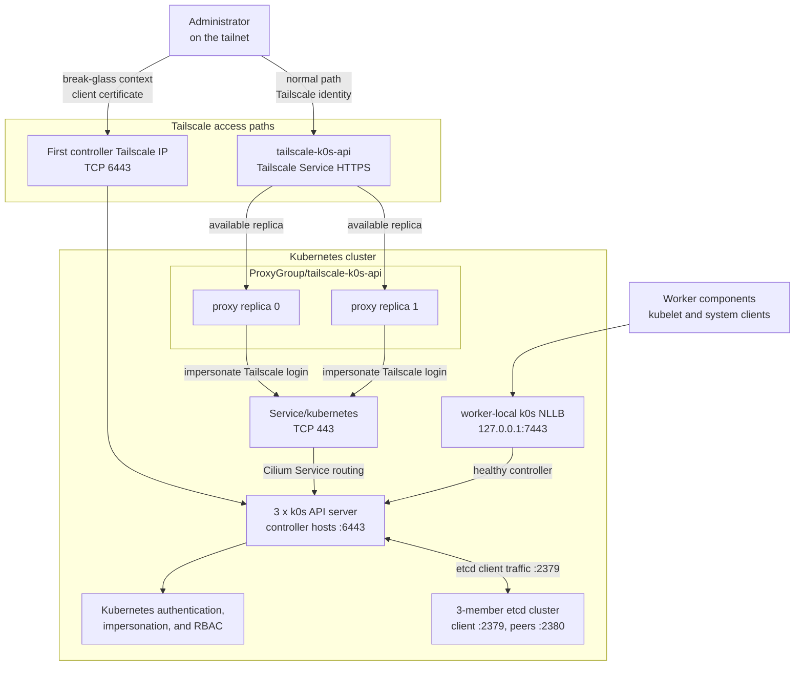
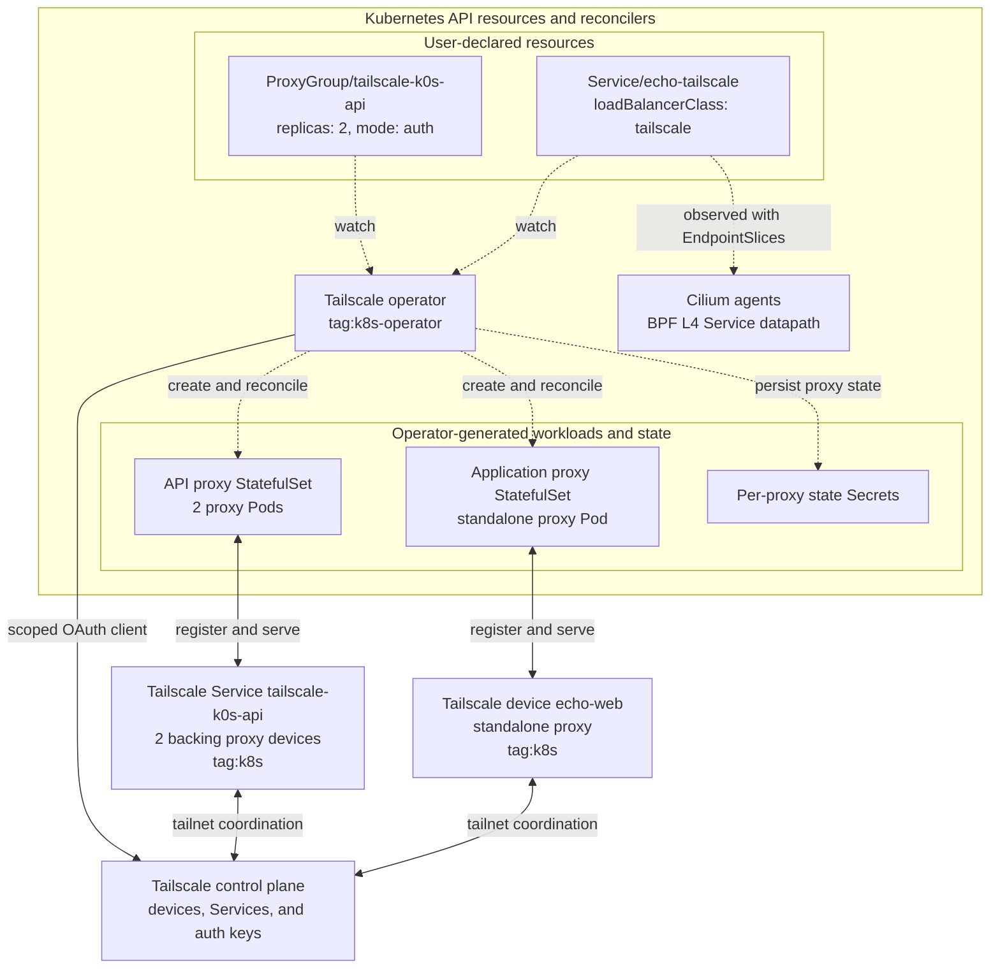
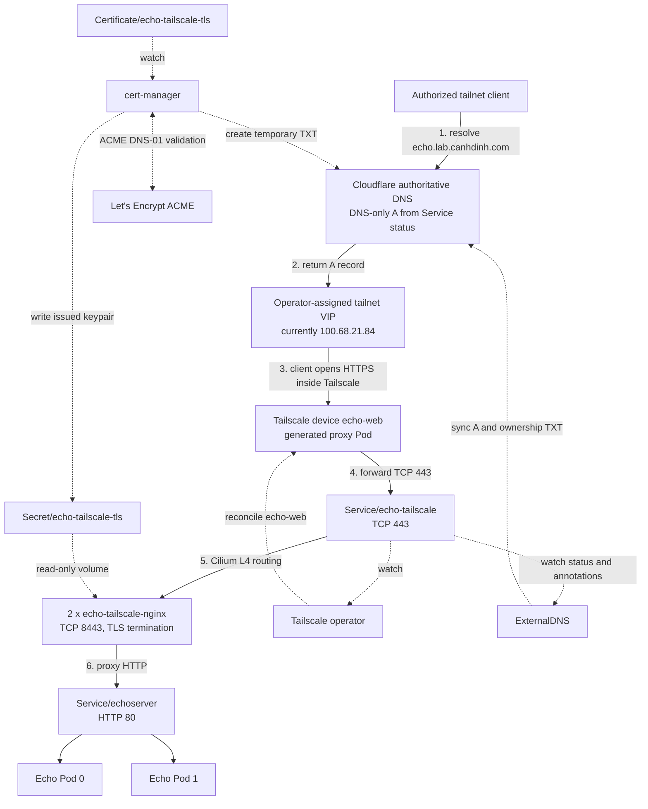

# `k0s` on Tailscale with Cilium

This runbook bootstraps an eight-node Kubernetes cluster with `k0sctl`, uses
Tailscale as the node-to-node underlay, and installs Cilium as a kube-proxy-free
CNI.

> **Reference configuration:** The topology, hostnames, `root` SSH access,
> `tailscale0` interface, network CIDRs, and pinned component versions reflect
> this repository's tested environment. Review [`k0s.yaml`](k0s.yaml) and
> [`cilium-values.yaml`](cilium-values.yaml) before applying them. The address
> updater changes Tailscale IP addresses only; it does not adapt hostnames,
> roles, interfaces, credentials, CIDRs, versions, or Cilium settings.

## Cluster topology

| Host | Role | Tailscale IPv4 |
| --- | --- | --- |
| `control-plane-01` | `controller` | `100.99.78.51` |
| `control-plane-02` | `controller` | `100.80.157.98` |
| `control-plane-03` | `controller` | `100.110.188.59` |
| `node-01` | `worker` | `100.100.187.71` |
| `node-02` | `worker` | `100.124.198.50` |
| `node-03` | `worker` | `100.114.226.97` |
| `node-04` | `worker` | `100.102.150.26` |
| `node-05` | `worker` | `100.108.18.99` |

> **Note:** Tailscale assigns node IPs per tailnet, so the addresses above are
> examples. The automated updater populates [`k0s.yaml`](k0s.yaml) with your
> tailnet's operational addresses before bootstrap.

### Physical and network topology



The diagram separates two network layers that share each worker. Tailscale is
the **node underlay**: the `100.x` addresses belong to hosts, and k0s uses them
for SSH, controller joins, etcd, kubelet registration, and Kubernetes API
traffic. Cilium is the **Pod overlay**: it allocates a `/24` per worker from
`10.244.0.0/16` and encapsulates cross-node Pod packets in VXLAN carried by
`tailscale0`. Service addresses from `10.96.0.0/12` are virtual addresses that
Cilium translates to Pod endpoints; they are not assigned to an interface.

Workers also need ordinary Internet egress for image pulls, Tailscale
coordination, and DERP. `tailscale0` remains Cilium's direct-routing device,
while `forceDeviceDetection: true` attaches the Cilium datapath to both
`tailscale0` and `eth0`. That lets Cilium masquerade Pod traffic leaving through
`eth0`; restricting attachment to `tailscale0` alone breaks public Pod egress.

Versions and networks:

| Component | Value |
| --- | --- |
| `k0sctl` | `v0.32.2` |
| `k0s` / Kubernetes | `v1.36.3+k0s.0` |
| Cilium CLI | `v0.19.7` |
| Cilium chart / agents | `v1.20.0` |
| Gateway API CRDs | standard channel `v1.6.1` |
| SOPS | `v3.13.3` |
| age | `v1.3.1` |
| Tailscale Kubernetes Operator chart | `1.98.9` |
| cert-manager chart | `v1.21.1` |
| ExternalDNS chart / app | `1.21.1` / `v0.21.0` |
| Echo Server image | `ealen/echo-server:0.9.2` |
| nginx image | `nginxinc/nginx-unprivileged:1.29.1-alpine` |
| Pod CIDR | `10.244.0.0/16` |
| Service CIDR | `10.96.0.0/12` |
| Node interface | `tailscale0` |

The controllers are control-plane-only nodes. Workloads run on the five workers.

### Why controllers do not appear in `kubectl get nodes`

The three control-plane hosts use the `k0sctl` role `controller`, not
`controller+worker`. Dedicated `k0s` controllers run control-plane components and
`etcd`, but they do not run `kubelet`. Kubernetes `Node` objects represent kubelets,
so `kubectl get nodes -o wide` correctly lists only the five workers.

Check controller and etcd health separately:

```bash
ssh root@control-plane-01 k0s status
ssh root@control-plane-02 k0s status
ssh root@control-plane-03 k0s status
ssh root@control-plane-01 k0s etcd member-list
```

Use `controller+worker` only when a controller must also register as a Node and
run kubelet. Those nodes are tainted by default, so regular workloads remain
unschedulable unless they tolerate the controller taint or `noTaints: true` is
configured intentionally.

## Prerequisites

Install the pinned tools from the repository root:

```bash
mise install
mise ls --local
```

Prepare the updater environment and verify the test suite:

```bash
uv sync --locked
uv run --locked python -m unittest scripts/test_update_k0s_tailscale_ips.py -v
```

The `uv sync --locked` command creates the repository-local `.venv` from
`pyproject.toml` and `uv.lock`. The test command runs all 13 unit tests against
the updater logic.

The control host and all cluster nodes must be connected to the same tailnet.
Use the repository's [Tailscale enrollment procedure](../../README.md#enroll-machines-in-tailscale)
when provisioning the lab with a reusable `tag:lab` auth key. Every configured
hostname must appear online in `tailscale status` before running the updater.
Tailscale SSH must permit `root` access from the control host to every node:

```bash
tailscale status
ssh root@control-plane-01 hostname
ssh root@node-01 hostname
```

Ensure the tailnet ACL and any host firewall permit required cluster traffic.
At minimum this includes:

- TCP `2380`, `6443`, `8132`, and `9443` between relevant `k0s` nodes
- TCP `10250` for kubelet access
- UDP `8472` between workers for Cilium VXLAN
- TCP `4240` between workers for Cilium health checks
- TCP `22` from the control host when not relying solely on Tailscale SSH policy

The Pod and Service CIDRs must not overlap the tailnet or another routed network.
In particular, do not allocate Pods from `100.64.0.0/10`; Tailscale uses that
CGNAT range for node addresses.

## Why the configuration matters

The cluster definition is [`k0s.yaml`](k0s.yaml). Every host sets both
`privateAddress` and `privateInterface: tailscale0`, making Tailscale the address
used by kubelet, etcd, and `k0sctl`-generated node settings.

The controllers are multihomed: each also has an iximiuz Labs LAN address on
`eth0`. Setting only `privateAddress` is not enough to select the `k0s` API address.
This setting is required:

```yaml
spec:
  api:
    onlyBindToAddress: true
```

With `k0sctl v0.32.2`, it causes each generated controller configuration to receive
its own Tailscale `spec.api.address`. Without it, `k0s` selected the first non-local
LAN address (`172.16.0.2`), and the other controllers could not join through the
tailnet.

The API certificate SANs include all three controller names and Tailscale IPs.
There is no `externalAddress`, HAProxy, virtual IP, or `k0s` control-plane load
balancer.

`k0s` node-local load balancing (NLLB) runs Envoy on each `worker` and exposes a
worker-local API endpoint at `127.0.0.1:7443`. NLLB makes in-cluster control-plane
access resilient, but it does not make the kubeconfig endpoint externally highly
available.

### Kubernetes API access and availability



There are three deliberately different API paths. The generated direct
kubeconfig targets the first controller and uses its Tailscale address; it is
the recovery path when operator-managed proxy Pods or cluster networking are
unavailable. An operator can manually point that context at either remaining
controller because all three addresses are API certificate SANs.

The normal remote-administration path uses the two-replica API `ProxyGroup`.
Tailscale authenticates the caller, each proxy forwards the login as a
Kubernetes impersonated user, and the API server applies Kubernetes RBAC. A
single proxy replica can restart without losing the endpoint, but both replicas
still depend on the cluster being able to schedule Pods and route to the
`kubernetes` Service.

Worker components use neither client path. They connect to the local NLLB
listener, which selects a healthy controller and isolates them from one
controller outage. NLLB does not provide an HA endpoint to the control host or
other tailnet clients.

## 1. Update Tailscale node addresses

Preview and apply the tailnet-specific addresses:

```bash
uv run scripts/update_k0s_tailscale_ips.py --dry-run
uv run scripts/update_k0s_tailscale_ips.py
```

The updater script defaults to `docs/k0s/k0s.yaml` when `--config` is omitted.
It updates each host's `privateAddress` and `ssh.address` and the controller
API certificate SANs. It aborts without writing unless every configured node
is online and has one unique Tailscale IPv4 address.

## 2. Validate the `k0sctl` plan

Run a dry run before every first installation or material configuration change:

```bash
k0sctl apply --config docs/k0s/k0s.yaml --dry-run
```

Confirm the generated controller configurations contain these node-specific
addresses:

```text
control-plane-01: spec.api.address: 100.99.78.51
control-plane-02: spec.api.address: 100.80.157.98
control-plane-03: spec.api.address: 100.110.188.59
```

Controller and worker join validation must target `100.99.78.51`, not a
`172.16.0.x` address.

## 3. Bootstrap `k0s`

```bash
k0sctl apply --config docs/k0s/k0s.yaml
```

`spec.options.wait.enabled` is intentionally `false`. A custom CNI is configured
and kube-proxy is disabled, so workers register as `NotReady` until Cilium is
installed. That intermediate state is expected.

Verify the controller processes and etcd membership:

```bash
ssh root@control-plane-01 k0s status
ssh root@control-plane-02 k0s status
ssh root@control-plane-03 k0s status
ssh root@control-plane-01 k0s etcd member-list
```

The `etcd` member list should contain all three Tailscale endpoints on TCP `2380`.

Verify worker registration:

```bash
ssh root@control-plane-01 k0s kubectl get nodes -o wide
```

Before Cilium, all five workers should exist with their `100.x` InternalIP and a
`NotReady` status.

### Recovering from a wrong API address

The first bootstrap attempt can leave `control-plane-01` running even when the
other controllers fail to join. Do not immediately reset a healthy first
controller. Add `api.onlyBindToAddress: true`, then verify the fix with a dry run.
`k0sctl` can reconcile the partial state on the next apply:

```bash
k0sctl apply --config docs/k0s/k0s.yaml --dry-run
k0sctl apply --config docs/k0s/k0s.yaml
```

Useful diagnostics:

```bash
ssh root@control-plane-01 \
  "journalctl -u k0scontroller --no-pager | grep 'using api address'"
ssh root@control-plane-01 \
  "ss -lntp | grep -E ':(2380|6443|9443)'"
```

## 4. Configure local cluster access

Back up an existing kubeconfig, fetch the `k0s` admin config, and secure both
files:

```bash
mkdir -p ~/.kube
if [[ -f ~/.kube/config ]]; then
  cp --backup=numbered --preserve=mode,timestamps \
    ~/.kube/config ~/.kube/config.pre-k0s
fi

tmp_kubeconfig=$(mktemp)
k0sctl kubeconfig --config docs/k0s/k0s.yaml > "$tmp_kubeconfig"
install -m 600 "$tmp_kubeconfig" ~/.kube/config
rm -f "$tmp_kubeconfig"
chmod 600 ~/.kube/config.pre-k0s 2>/dev/null || true
```

Verify the active context and API:

```bash
kubectl config current-context
kubectl get --raw=/readyz
```

Expected context: `tailscale-k0s`. Expected readiness response: `ok`.

The generated kubeconfig points to the first controller. If it is unavailable,
change the kubeconfig server to another controller Tailscale IP. NLLB protects
worker components, not clients running on the control host.

## 5. Install Gateway API CRDs

Cilium Gateway API support requires the CRDs to exist before Cilium starts:

```bash
kubectl apply --server-side \
  -f https://github.com/kubernetes-sigs/gateway-api/releases/download/v1.6.1/standard-install.yaml

kubectl wait --for=condition=Established --timeout=120s \
  crd/gatewayclasses.gateway.networking.k8s.io \
  crd/gateways.gateway.networking.k8s.io \
  crd/httproutes.gateway.networking.k8s.io \
  crd/grpcroutes.gateway.networking.k8s.io \
  crd/referencegrants.gateway.networking.k8s.io
```

This capability remains installed in the live cluster because
`gatewayAPI.enabled: true` creates the default `cilium` GatewayClass. The Echo
ingress described below does not create a `Gateway`, `HTTPRoute`, or Cilium
Envoy configuration.

## 6. Install Cilium

Cilium values are defined in [`cilium-values.yaml`](cilium-values.yaml).
They configure:

- full kube-proxy replacement
- Cilium access to `k0s` NLLB at `127.0.0.1:7443`
- `tailscale0` as the datapath device
- VXLAN tunneling over the Tailscale underlay
- cluster-pool IPAM with one `/24` per worker from `10.244.0.0/16`
- socket-level load balancing only in the host namespace, allowing Tailscale
  proxy Pods to use the packet-level Kubernetes Service path
- two Cilium operator replicas
- a separate Envoy DaemonSet
- Gateway API and the default `cilium` GatewayClass, retained but unused by Echo
- Hubble, Hubble Relay, and Hubble UI

Install and wait for readiness:

```bash
cilium install --version 1.20.0 --values docs/k0s/cilium-values.yaml
cilium status --wait
```

Expected readiness:

```text
Cilium:          OK (5/5)
Operator:        OK (2/2)
Envoy DaemonSet: OK (5/5)
Hubble Relay:    OK (1/1)
Hubble UI:       Ready (1/1)
```

## 7. Verify the cluster

```bash
kubectl get nodes -o wide
kubectl -n kube-system get pods -o wide
kubectl get gatewayclass cilium -o wide
kubectl -n kube-system get daemonset kube-proxy
```

Expected results:

- all five workers are `Ready` and use their Tailscale InternalIP
- Cilium, Envoy, CoreDNS, Hubble, NLLB, and konnectivity Pods are running
- GatewayClass `cilium` is `Accepted=True`
- querying the kube-proxy DaemonSet returns `NotFound`

Run a focused connectivity test:

```bash
cilium connectivity test \
  --ip-families ipv4 \
  --test '^no-policies/' \
  --test '^client-egress/' \
  --test '^dns-only/' \
  --hubble=false \
  --flow-validation disabled \
  --timeout 15m
```

This verified three tests and 85 actions covering baseline pod, Service,
NodePort, world, egress-policy, and DNS-policy paths.

With Cilium CLI `v0.19.7`, the `--test` flag matches the combined
`test/scenario` string. To select a whole test by name, include its trailing
slash, for example `^no-policies/`. A pattern such as `pod-to-pod` matches that
scenario in many tests and creates a much larger run. In the verified CLI,
`^no-policies$` matched nothing because the selector includes `/scenario`.

Clean test resources afterward:

```bash
cilium connectivity test --cleanup
kubectl get cnp,ccnp -A
kubectl get namespaces | grep cilium-test || true
```

## 8. Install the Tailscale Kubernetes Operator

The remaining steps add a Tailscale-managed Kubernetes API endpoint and expose
application workloads through Tailscale LoadBalancer Services. They retain the
direct controller kubeconfig as a break-glass path.

### Operator control and reconciliation



The operator is a **reconciler**, not an application traffic hop. It watches
the user-declared `ProxyGroup` and `LoadBalancer` Service, creates their proxy
workloads and state Secrets, and uses its scoped OAuth client to request auth
keys and manage tailnet devices and Services. The operator device carries
`tag:k8s-operator`; managed proxy identities carry `tag:k8s`, so ACLs can grant
proxy access without granting the operator device the same data-plane access.

`ProxyGroup/tailscale-k0s-api` produces a two-replica API proxy StatefulSet.
`Service/echo-tailscale` produces a separate, generated proxy StatefulSet for
the tailnet device `echo-web`. Generated workload names can contain
operator-assigned suffixes and are not stable interfaces. Those proxy Pods join
the tailnet and carry traffic; the operator Pod can restart without being in an
established client connection's forwarding path. Cilium does not create either
tailnet endpoint. Its agents observe Service and EndpointSlice state and program
their own BPF frontend and backend selection after traffic enters the cluster.

There are two secret boundaries. The pre-created `operator-oauth` Secret gives
the operator its Tailscale API credentials, while operator-generated Secrets
hold individual proxy state. SOPS protects the user-supplied OAuth values in
Git, but Kubernetes and etcd must still protect the live Secret objects.

### Prepare the encrypted lab configuration

SOPS encrypts all deployment credentials and runtime values in
[`secrets/lab.sops.yaml`](../../secrets/lab.sops.yaml) to the public age
recipient in [`.sops.yaml`](../../.sops.yaml). The corresponding private age
identity stays outside the repository at `~/.config/sops/age/keys.txt`.

The encrypted document supplies:

| Path | Purpose |
| --- | --- |
| `tailscale.oauth.client_id` | Operator OAuth client ID |
| `tailscale.oauth.client_secret` | Operator OAuth client secret |
| `tailscale.kubernetes_user` | Tailscale login mapped into Kubernetes RBAC |
| `cloudflare.zone_id` | `canhdinh.com` zone ID |
| `cloudflare.cert_manager_api_token` | cert-manager DNS-01 token |
| `cloudflare.external_dns_api_token` | ExternalDNS record-management token |
| `acme.email` | Let's Encrypt account email |

The OAuth client requires Services `Write`, Devices/Core `Write`, and Auth Keys
`Write`, and must be tagged `tag:k8s-operator`. Each Cloudflare token requires
Zone `Read` and DNS `Edit`, restricted to `canhdinh.com`. Use separate
Cloudflare tokens so either controller can be revoked independently.

Install the pinned tools, secure the private identity, and edit the encrypted
file through SOPS. Never open it with a normal editor and never create a
plaintext copy:

```bash
mise install
chmod 600 ~/.config/sops/age/keys.txt
sops secrets/lab.sops.yaml
sops filestatus secrets/lab.sops.yaml
```

Expected status: `{"encrypted":true}`. Confirm that every placeholder has been
replaced before provisioning:

Back up `~/.config/sops/age/keys.txt` in a separate encrypted password manager
or offline vault. It is the only identity currently able to decrypt this file;
losing it makes the committed ciphertext unrecoverable. Never copy the private
identity into this repository.

```bash
(
  set -e
  if [[ $- == *x* ]]; then
    printf 'Disable shell tracing before decrypting secrets.\n' >&2
    exit 1
  fi

  sops_file=secrets/lab.sops.yaml
  sops_paths=(
    '["tailscale"]["oauth"]["client_id"]'
    '["tailscale"]["oauth"]["client_secret"]'
    '["tailscale"]["kubernetes_user"]'
    '["cloudflare"]["zone_id"]'
    '["cloudflare"]["cert_manager_api_token"]'
    '["cloudflare"]["external_dns_api_token"]'
    '["acme"]["email"]'
  )

  for sops_path in "${sops_paths[@]}"; do
    sops_value=$(sops decrypt --extract "$sops_path" "$sops_file")
    if [[ -z "$sops_value" || "$sops_value" == REPLACE_* || \
      "$sops_value" == "you@example.com" ]]; then
      printf 'Set the encrypted value at %s\n' "$sops_path" >&2
      exit 1
    fi
  done
)
```

The runbook decrypts only the field required by each operation. It never writes
the complete plaintext document to disk. Kubernetes will additionally hold
controller-generated ACME account keys, TLS private keys, and Tailscale proxy
state Secrets; these require no user-supplied values.

> **Kubernetes storage boundary:** SOPS protects secrets in Git, not after they
> are submitted to Kubernetes. Kubernetes Secret values are only base64-encoded
> and this reference cluster does not configure API-server encryption at rest.
> Restrict controller and etcd-backup access accordingly. Add a Kubernetes
> encryption provider and rewrite existing Secrets before treating controller
> disks or etcd backups as encrypted storage.

### Configure the tailnet

Enable HTTPS from the Tailscale admin console **DNS** page. The Kubernetes API
proxy requires HTTPS for its MagicDNS name.

Merge the following entries into the existing tailnet policy. Replace
`you@example.com` with the value stored at `tailscale.kubernetes_user`; do not
remove the existing `tag:lab` owner or SSH rules:

```json
{
  "tagOwners": {
    "tag:k8s-operator": [],
    "tag:k8s": ["tag:k8s-operator"]
  },
  "autoApprovers": {
    "services": {
      "svc:*": ["tag:k8s"]
    }
  },
  "grants": [
    {
      "src": ["you@example.com"],
      "dst": ["tag:k8s"],
      "ip": ["tcp:80", "tcp:443"]
    }
  ]
}
```

The operator uses `tag:k8s-operator`; its managed API and ingress proxies use
`tag:k8s`. The service auto-approver lets the API ProxyGroup advertise its
Tailscale Service without a manual approval step.

Create an OAuth client from **Trust credentials** in the Tailscale admin console:

1. Grant `Write` for **General > Services**, **Devices > Core**, and
   **Keys > Auth Keys**.
2. Assign `tag:k8s-operator` to the client.
3. Run `sops secrets/lab.sops.yaml` and set the OAuth client ID and secret. The
  client secret is shown only once.

### Create the operator Secret

Create the namespace and securely stage only the two OAuth fields. These
commands work in both Bash and Zsh:

```bash
(
  set -e
  set -o pipefail
  if [[ $- == *x* ]]; then
    printf 'Disable shell tracing before decrypting secrets.\n' >&2
    exit 1
  fi

  kubectl create namespace tailscale --dry-run=client -o yaml | \
    kubectl apply -f -

  oauth_dir=$(mktemp -d)
  chmod 700 "$oauth_dir"
  cleanup_oauth() {
    rm -rf "$oauth_dir"
    unset TS_OAUTH_CLIENT_ID TS_OAUTH_CLIENT_SECRET
  }
  trap cleanup_oauth EXIT
  trap 'exit 130' HUP INT TERM

  umask 077
  TS_OAUTH_CLIENT_ID=$(sops decrypt \
    --extract '["tailscale"]["oauth"]["client_id"]' \
    secrets/lab.sops.yaml)
  TS_OAUTH_CLIENT_SECRET=$(sops decrypt \
    --extract '["tailscale"]["oauth"]["client_secret"]' \
    secrets/lab.sops.yaml)
  if [[ -z "$TS_OAUTH_CLIENT_ID" || -z "$TS_OAUTH_CLIENT_SECRET" || \
    "$TS_OAUTH_CLIENT_ID" == REPLACE_* || \
    "$TS_OAUTH_CLIENT_SECRET" == REPLACE_* ]]; then
    printf 'Set both Tailscale OAuth values with SOPS.\n' >&2
    exit 1
  fi

  printf '%s' "$TS_OAUTH_CLIENT_ID" >"$oauth_dir/client_id"
  printf '%s' "$TS_OAUTH_CLIENT_SECRET" >"$oauth_dir/client_secret"

  kubectl -n tailscale create secret generic operator-oauth \
    --from-file=client_id="$oauth_dir/client_id" \
    --from-file=client_secret="$oauth_dir/client_secret" \
    --dry-run=client -o yaml | kubectl apply -f -
)
```

The operator chart automatically mounts the pre-created `operator-oauth` Secret
when OAuth values are omitted from Helm.

### Install and validate the operator

```bash
helm repo add tailscale https://pkgs.tailscale.com/helmcharts
helm repo update

helm upgrade --install tailscale-operator tailscale/tailscale-operator \
  --version 1.98.9 \
  --namespace tailscale \
  --set-string apiServerProxyConfig.allowImpersonation=true \
  --wait

kubectl -n tailscale rollout status deployment/operator --timeout=5m
kubectl -n tailscale get deployment,pods
kubectl get crd proxygroups.tailscale.com proxyclasses.tailscale.com
kubectl -n tailscale logs deployment/operator --tail=100
```

Confirm that the Tailscale admin console lists `tailscale-operator` with
`tag:k8s-operator`. Do not continue until the Deployment is available and the
operator device is online.

## 9. Expose the Kubernetes API through a ProxyGroup

Create a dedicated two-replica API proxy in authentication mode:

```bash
kubectl apply -f - <<'YAML'
apiVersion: tailscale.com/v1alpha1
kind: ProxyGroup
metadata:
  name: tailscale-k0s-api
spec:
  type: kube-apiserver
  replicas: 2
  kubeAPIServer:
    mode: auth
    hostname: tailscale-k0s-api
YAML

kubectl wait proxygroup/tailscale-k0s-api \
  --for=condition=ProxyGroupReady=true \
  --timeout=5m
kubectl get proxygroup tailscale-k0s-api
kubectl -n tailscale get statefulset,pods
```

The proxy authenticates the caller from its Tailscale identity but grants no
Kubernetes permissions by default. Bind only the exact login used for cluster
administration. For this personal lab, grant that user `cluster-admin`:

```bash
(
  set -e
  set -o pipefail
  TAILSCALE_KUBERNETES_USER=$(sops decrypt \
    --extract '["tailscale"]["kubernetes_user"]' \
    secrets/lab.sops.yaml)
  if [[ -z "$TAILSCALE_KUBERNETES_USER" || \
    "$TAILSCALE_KUBERNETES_USER" == "you@example.com" ]]; then
    printf 'Set tailscale.kubernetes_user with SOPS.\n' >&2
    exit 1
  fi

  kubectl create clusterrolebinding tailscale-k0s-admin \
    --clusterrole=cluster-admin \
    --user="$TAILSCALE_KUBERNETES_USER" \
    --dry-run=client -o yaml | kubectl apply -f -
)
```

Keep a backup and the current direct context before adding the proxy context:

```bash
cp --backup=numbered --preserve=mode,timestamps \
  ~/.kube/config ~/.kube/config.pre-tailscale-proxy
chmod 600 ~/.kube/config.pre-tailscale-proxy

direct_context=$(kubectl config current-context)
proxy_url=$(kubectl get proxygroup tailscale-k0s-api \
  -o jsonpath='{.status.url}')
printf 'Direct context: %s\nProxy URL: %s\n' "$direct_context" "$proxy_url"

tailscale configure kubeconfig "$proxy_url"
kubectl config get-contexts
proxy_context=$(kubectl config current-context)
kubectl auth whoami
kubectl get nodes -o wide
```

`kubectl auth whoami` must show the Tailscale login identity. Return to direct
access at any time with the saved direct context.

Verify that one API proxy can restart without interrupting API requests through
the other replica:

```bash
(
  set -e
  failover_dir=$(mktemp -d)
  probe_pid=

  cleanup_failover() {
    exit_code=$?
    trap - EXIT HUP INT TERM
    touch "$failover_dir/stop" 2>/dev/null || true
    if [[ -n "$probe_pid" ]]; then
      wait "$probe_pid" 2>/dev/null || true
    fi
    rm -rf "$failover_dir"
    kubectl config use-context "$direct_context" >/dev/null 2>&1 || true
    exit "$exit_code"
  }
  trap cleanup_failover EXIT
  trap 'exit 130' HUP INT TERM

  proxy_pod=$(kubectl --context "$proxy_context" -n tailscale get pods \
    -l tailscale.com/parent-resource=tailscale-k0s-api \
    -o jsonpath='{.items[0].metadata.name}')
  proxy_uid=$(kubectl --context "$proxy_context" -n tailscale get pod \
    "$proxy_pod" -o jsonpath='{.metadata.uid}')

  (
    failures=0
    while [[ ! -e "$failover_dir/stop" ]]; do
      if ! kubectl --context "$proxy_context" --request-timeout=5s \
        get --raw=/readyz >/dev/null; then
        failures=$((failures + 1))
      fi
      printf '%s\n' "$failures" >"$failover_dir/failures"
      : >"$failover_dir/probe-complete"
      sleep 1
    done
  ) &
  probe_pid=$!

  while [[ ! -e "$failover_dir/probe-complete" ]]; do sleep 1; done
  kubectl --context "$proxy_context" -n tailscale delete pod "$proxy_pod" \
    --wait=false

  replacement_uid=
  wait_started=$SECONDS
  while [[ -z "$replacement_uid" || "$replacement_uid" == "$proxy_uid" ]]; do
    if (( SECONDS - wait_started >= 300 )); then
      printf 'Timed out waiting for replacement of %s\n' "$proxy_pod" >&2
      exit 1
    fi
    replacement_uid=$(kubectl --context "$proxy_context" -n tailscale get pod \
      "$proxy_pod" -o jsonpath='{.metadata.uid}' 2>/dev/null || true)
    sleep 1
  done

  kubectl --context "$proxy_context" -n tailscale wait pod/"$proxy_pod" \
    --for=condition=Ready=true \
    --timeout=5m
  kubectl --context "$proxy_context" -n tailscale rollout status \
    statefulset/tailscale-k0s-api --timeout=5m

  touch "$failover_dir/stop"
  wait "$probe_pid"
  probe_pid=
  proxy_failures=$(cat "$failover_dir/failures")

  kubectl --context "$proxy_context" -n tailscale get pods \
    -l tailscale.com/parent-resource=tailscale-k0s-api
  printf 'Failed API probes during one-proxy restart: %s\n' "$proxy_failures"
  if (( proxy_failures != 0 )); then
    exit 1
  fi
)
```

Expected failed probes: `0`. To return to direct access later, when the shell
variables above no longer exist, use the original context name documented in
step 4:

```bash
kubectl config use-context tailscale-k0s
```

The API proxy runs inside the cluster. If the cluster cannot schedule its Pods,
use the direct controller context for recovery.

## 10. Configure Cilium for Tailscale proxy Pods

Tailscale LoadBalancer proxy Pods require packet-level Kubernetes Service
handling when Cilium replaces kube-proxy. The checked-in values therefore set
`socketLB.hostNamespaceOnly: true`. They pin `tailscale0` as the direct-routing
device and enable forced device detection so Cilium also attaches to `eth0` and
masquerades proxy Pod traffic to Tailscale coordination and DERP servers.

Fresh clusters already use the updated values during step 6 and only need to
verify them here:

```bash
helm upgrade cilium cilium/cilium \
  --version 1.20.0 \
  --namespace kube-system \
  --reset-values \
  --values docs/k0s/cilium-values.yaml \
  --wait \
  --timeout 10m
cilium status --wait

kubectl -n kube-system rollout status daemonset/cilium --timeout=10m
kubectl -n kube-system rollout status daemonset/cilium-envoy --timeout=10m
kubectl -n kube-system get configmap cilium-config \
  -o jsonpath='{.data.bpf-lb-sock-hostns-only}{"\n"}{.data.force-device-detection}{"\n"}{.data.direct-routing-device}{"\n"}'
```

Expected values: `true`, `true`, and `tailscale0`. On every node, Cilium status
must list both `eth0` and `tailscale0` under masquerading devices.

## 11. Install cert-manager and configure Cloudflare DNS-01

Install cert-manager with Gateway API support:

```bash
helm upgrade --install cert-manager \
  oci://quay.io/jetstack/charts/cert-manager \
  --version v1.21.1 \
  --namespace cert-manager \
  --create-namespace \
  --set crds.enabled=true \
  --set config.gatewayAPI.enabled=true \
  --wait

kubectl -n cert-manager get deployments,pods
```

Gateway API support matches the retained live Cilium capability. The Echo
application uses a standalone `Certificate`, so its certificate issuance does
not depend on a Gateway listener.

Load the cert-manager Cloudflare token into an unexported shell variable and
create its Kubernetes Secret without placing it in a command argument or
plaintext file:

```bash
(
  set -e
  set -o pipefail
  if [[ $- == *x* ]]; then
    printf 'Disable shell tracing before decrypting secrets.\n' >&2
    exit 1
  fi

  CLOUDFLARE_CERT_MANAGER_TOKEN=$(sops decrypt \
    --extract '["cloudflare"]["cert_manager_api_token"]' \
    secrets/lab.sops.yaml)
  if [[ -z "$CLOUDFLARE_CERT_MANAGER_TOKEN" || \
    "$CLOUDFLARE_CERT_MANAGER_TOKEN" == REPLACE_* ]]; then
    printf 'Set cloudflare.cert_manager_api_token with SOPS.\n' >&2
    exit 1
  fi

  printf '%s' "$CLOUDFLARE_CERT_MANAGER_TOKEN" | \
    kubectl -n cert-manager create secret generic cloudflare-api-token \
      --from-file=api-token=/dev/stdin \
      --dry-run=client -o yaml | kubectl apply -f -
)
```

Create the production issuer using the encrypted ACME account email:

```bash
(
  set -e
  set -o pipefail
  ACME_EMAIL=$(sops decrypt \
    --extract '["acme"]["email"]' \
    secrets/lab.sops.yaml)
  if [[ -z "$ACME_EMAIL" || "$ACME_EMAIL" == "you@example.com" ]]; then
    printf 'Set acme.email with SOPS.\n' >&2
    exit 1
  fi

  cat <<YAML | kubectl apply -f -
apiVersion: cert-manager.io/v1
kind: ClusterIssuer
metadata:
  name: letsencrypt-production
spec:
  acme:
    email: ${ACME_EMAIL}
    server: https://acme-v02.api.letsencrypt.org/directory
    privateKeySecretRef:
      name: letsencrypt-production-account-key
    solvers:
      - selector:
          dnsZones:
            - canhdinh.com
        dns01:
          cloudflare:
            apiTokenSecretRef:
              name: cloudflare-api-token
              key: api-token
YAML

  kubectl wait clusterissuer/letsencrypt-production \
    --for=condition=Ready=true \
    --timeout=5m
  kubectl get clusterissuer letsencrypt-production
)
```

DNS-01 validates ownership through a temporary public TXT record. The Echo
Server does not need public network reachability for certificate issuance.

## 12. Install ExternalDNS for `lab.canhdinh.com`

Create the separate ExternalDNS token Secret from an unexported shell variable:

```bash
kubectl create namespace external-dns --dry-run=client -o yaml | kubectl apply -f -

(
  set -e
  set -o pipefail
  if [[ $- == *x* ]]; then
    printf 'Disable shell tracing before decrypting secrets.\n' >&2
    exit 1
  fi

  CLOUDFLARE_EXTERNAL_DNS_TOKEN=$(sops decrypt \
    --extract '["cloudflare"]["external_dns_api_token"]' \
    secrets/lab.sops.yaml)
  if [[ -z "$CLOUDFLARE_EXTERNAL_DNS_TOKEN" || \
    "$CLOUDFLARE_EXTERNAL_DNS_TOKEN" == REPLACE_* ]]; then
    printf 'Set cloudflare.external_dns_api_token with SOPS.\n' >&2
    exit 1
  fi

  printf '%s' "$CLOUDFLARE_EXTERNAL_DNS_TOKEN" | \
    kubectl -n external-dns create secret generic cloudflare-api-token \
      --from-file=api-token=/dev/stdin \
      --dry-run=client -o yaml | kubectl apply -f -
)
```

Supply the non-secret Cloudflare zone ID and install ExternalDNS. Its TXT
registry prevents this instance from deleting records owned elsewhere:

```bash
(
  set -e
  set -o pipefail
  CLOUDFLARE_ZONE_ID=$(sops decrypt \
    --extract '["cloudflare"]["zone_id"]' \
    secrets/lab.sops.yaml)
  if [[ -z "$CLOUDFLARE_ZONE_ID" || \
    "$CLOUDFLARE_ZONE_ID" == REPLACE_* ]]; then
    printf 'Set cloudflare.zone_id with SOPS.\n' >&2
    exit 1
  fi

  external_dns_values=$(mktemp)
  cleanup_external_dns_values() {
    rm -f "$external_dns_values"
    unset CLOUDFLARE_ZONE_ID
  }
  trap cleanup_external_dns_values EXIT
  trap 'exit 130' HUP INT TERM

  cat >"$external_dns_values" <<YAML
provider:
  name: cloudflare
sources:
  - gateway-httproute
  - service
domainFilters:
  - lab.canhdinh.com
policy: sync
registry: txt
txtOwnerId: tailscale-k0s
extraArgs:
  - --zone-id-filter=${CLOUDFLARE_ZONE_ID}
env:
  - name: CF_API_TOKEN
    valueFrom:
      secretKeyRef:
        name: cloudflare-api-token
        key: api-token
YAML

  helm repo add external-dns https://kubernetes-sigs.github.io/external-dns
  helm repo update
  helm upgrade --install external-dns external-dns/external-dns \
    --version 1.21.1 \
    --namespace external-dns \
    --values "$external_dns_values" \
    --wait

  kubectl -n external-dns rollout status deployment/external-dns --timeout=5m
  kubectl -n external-dns logs deployment/external-dns --tail=100
)
```

The `gateway-httproute` source matches the retained live Gateway capability but
currently has no application routes to reconcile. The Echo A and TXT records
come from the `service` source and annotations on `Service/echo-tailscale`.

## 13. Use a Tailscale L4 Service for application ingress

Do not place the Tailscale proxy Pod behind Cilium's Gateway L7 service. Cilium
1.20 can blackhole Pod-originated BPF TPROXY traffic before external Envoy, and
host-level Tailscale policy routing can also intercept Envoy upstream marks.

Instead, terminate TLS in a normal nginx Deployment and expose it through a
regular `LoadBalancer` Service with `loadBalancerClass: tailscale`. This keeps
the application tailnet-only while bypassing Cilium's L7 TPROXY path. Cilium
continues to provide CNI, kube-proxy replacement, and ordinary L4 Service
routing.

### Application request and controller flows



Solid arrows are the request path; dotted arrows are controller reconciliation.
Cloudflare answers a public DNS query but never proxies the HTTP connection.
The live Service currently reports `100.68.21.84`, but that operator-assigned
VIP is status, not static configuration, and can change if the managed endpoint
is recreated. Any returned address remains reachable only through Tailscale,
where tailnet ACLs authenticate and authorize the client. Tailscale terminates
its tunnel at the `echo-web` device, but the inner HTTPS stream remains encrypted
until nginx terminates application TLS on port `8443`.

ExternalDNS publishes the address reported on `Service/echo-tailscale` and owns
the corresponding A and TXT records. Independently, cert-manager completes an
ACME DNS-01 challenge through Cloudflare and writes the issued certificate to
`Secret/echo-tailscale-tls`, which both nginx replicas mount read-only. DNS-01
therefore needs public DNS authority, not public reachability to the service.

Cilium performs ordinary L4 Service translation twice: first from
`echo-tailscale:443` to an nginx endpoint, then from `echoserver:80` to an Echo
Pod. `Gateway`, `HTTPRoute`, and Cilium Envoy TPROXY resources are deliberately
absent from this request path because the Cilium 1.20 Gateway path failed in
this Tailscale-backed topology.

## 14. Deploy Echo Server at `echo.lab.canhdinh.com`

Deploy the upstream Echo Server image as a two-replica test workload:

```bash
kubectl apply -f - <<'YAML'
apiVersion: v1
kind: Namespace
metadata:
  name: echoserver
---
apiVersion: apps/v1
kind: Deployment
metadata:
  name: echoserver
  namespace: echoserver
spec:
  replicas: 2
  selector:
    matchLabels:
      app: echoserver
  template:
    metadata:
      labels:
        app: echoserver
    spec:
      containers:
        - name: echoserver
          image: ealen/echo-server:0.9.2
          imagePullPolicy: IfNotPresent
          env:
            - name: PORT
              value: "80"
          ports:
            - name: http
              containerPort: 80
          readinessProbe:
            httpGet:
              path: /
              port: http
          livenessProbe:
            httpGet:
              path: /
              port: http
---
apiVersion: v1
kind: Service
metadata:
  name: echoserver
  namespace: echoserver
spec:
  type: ClusterIP
  selector:
    app: echoserver
  ports:
    - name: http
      port: 80
      targetPort: http
YAML

kubectl -n echoserver rollout status deployment/echoserver --timeout=5m
```

Create a standalone certificate, an unprivileged nginx TLS proxy, and its
Tailscale LoadBalancer Service:

```bash
kubectl apply -f - <<'YAML'
apiVersion: cert-manager.io/v1
kind: Certificate
metadata:
  name: echo-tailscale-tls
  namespace: echoserver
spec:
  secretName: echo-tailscale-tls
  dnsNames:
    - echo.lab.canhdinh.com
  issuerRef:
    group: cert-manager.io
    kind: ClusterIssuer
    name: letsencrypt-production
  usages:
    - digital signature
    - key encipherment
---
apiVersion: v1
kind: ConfigMap
metadata:
  name: echo-tailscale-nginx
  namespace: echoserver
data:
  nginx.conf: |
    worker_processes auto;
    pid /tmp/nginx.pid;

    events {
      worker_connections 1024;
    }

    http {
      include /etc/nginx/mime.types;
      default_type application/octet-stream;
      access_log /dev/stdout;
      error_log /dev/stderr notice;
      proxy_temp_path /tmp/proxy_temp;
      client_body_temp_path /tmp/client_temp;
      fastcgi_temp_path /tmp/fastcgi_temp;
      uwsgi_temp_path /tmp/uwsgi_temp;
      scgi_temp_path /tmp/scgi_temp;

      server {
        listen 8443 ssl;
        server_name echo.lab.canhdinh.com;

        ssl_certificate /etc/nginx/tls/tls.crt;
        ssl_certificate_key /etc/nginx/tls/tls.key;
        ssl_protocols TLSv1.2 TLSv1.3;

        location / {
          proxy_pass http://echoserver.echoserver.svc.cluster.local:80;
          proxy_http_version 1.1;
          proxy_set_header Host $host;
          proxy_set_header X-Real-IP $remote_addr;
          proxy_set_header X-Forwarded-For $proxy_add_x_forwarded_for;
          proxy_set_header X-Forwarded-Proto https;
        }
      }
    }
---
apiVersion: apps/v1
kind: Deployment
metadata:
  name: echo-tailscale-nginx
  namespace: echoserver
spec:
  replicas: 2
  selector:
    matchLabels:
      app: echo-tailscale-nginx
  template:
    metadata:
      labels:
        app: echo-tailscale-nginx
    spec:
      affinity:
        podAntiAffinity:
          preferredDuringSchedulingIgnoredDuringExecution:
            - weight: 100
              podAffinityTerm:
                topologyKey: kubernetes.io/hostname
                labelSelector:
                  matchLabels:
                    app: echo-tailscale-nginx
      containers:
        - name: nginx
          image: nginxinc/nginx-unprivileged:1.29.1-alpine
          imagePullPolicy: IfNotPresent
          ports:
            - name: https
              containerPort: 8443
          readinessProbe:
            tcpSocket:
              port: https
          livenessProbe:
            tcpSocket:
              port: https
          securityContext:
            allowPrivilegeEscalation: false
            capabilities:
              drop:
                - ALL
            readOnlyRootFilesystem: true
            runAsNonRoot: true
          volumeMounts:
            - name: config
              mountPath: /etc/nginx/nginx.conf
              subPath: nginx.conf
              readOnly: true
            - name: tls
              mountPath: /etc/nginx/tls
              readOnly: true
            - name: tmp
              mountPath: /tmp
      volumes:
        - name: config
          configMap:
            name: echo-tailscale-nginx
        - name: tls
          secret:
            secretName: echo-tailscale-tls
        - name: tmp
          emptyDir: {}
---
apiVersion: v1
kind: Service
metadata:
  name: echo-tailscale
  namespace: echoserver
  annotations:
    tailscale.com/hostname: echo-web
    external-dns.alpha.kubernetes.io/hostname: echo.lab.canhdinh.com
    external-dns.alpha.kubernetes.io/cloudflare-proxied: "false"
spec:
  type: LoadBalancer
  loadBalancerClass: tailscale
  selector:
    app: echo-tailscale-nginx
  ports:
    - name: https
      port: 443
      targetPort: https
      protocol: TCP
YAML

kubectl -n echoserver wait certificate/echo-tailscale-tls \
  --for=condition=Ready=true \
  --timeout=10m
kubectl -n echoserver rollout status deployment/echo-tailscale-nginx \
  --timeout=5m
kubectl -n echoserver wait service/echo-tailscale \
  --for=condition=TailscaleProxyReady=True \
  --timeout=10m
```

## 15. Verify DNS, TLS, and application routing

Inspect the replacement Service, Certificate, and endpoints:

```bash
kubectl -n echoserver get deployment,service,certificate
kubectl -n echoserver get service echo-tailscale -o wide
kubectl -n echoserver get service echo-tailscale \
  -o jsonpath='{.spec.loadBalancerClass}{"\n"}{.status.loadBalancer.ingress}{"\n"}'
kubectl -n tailscale get statefulset,pods
```

Expected load balancer class: `tailscale`. Its status must contain a Tailscale
address before ExternalDNS can publish the application record.

Inspect certificate issuance if readiness times out:

```bash
kubectl -n echoserver get certificate,certificaterequest,order,challenge
kubectl -n echoserver describe certificate echo-tailscale-tls
kubectl -n cert-manager logs deployment/cert-manager --tail=100
```

Verify Cloudflare and application traffic from a tailnet client:

```bash
dig +short echo.lab.canhdinh.com A
tailscale status
curl --fail --show-error --silent https://echo.lab.canhdinh.com | head

kubectl -n echoserver get endpointslice \
  -l kubernetes.io/service-name=echo-tailscale \
  -o jsonpath='{range .items[*].endpoints[*]}{.addresses[0]}{"\t"}{.conditions.ready}{"\n"}{end}'

for request in 1 2 3 4 5 6; do
  curl --fail --show-error --silent \
    'https://echo.lab.canhdinh.com/?echo_env_body=HOSTNAME'
  printf '\n'
done
```

The A record should be in `100.64.0.0/10`, and Cloudflare must show it as
**DNS only**. The EndpointSlice output must contain two ready endpoints. The
repeated request demonstrates nginx routing to one or both Echo Pods; endpoint
readiness, not request distribution, proves that both nginx replicas are
available. ExternalDNS also creates a TXT ownership record with owner ID
`tailscale-k0s`.

Finally, test from a separate device that is not connected to the tailnet. DNS
will still resolve publicly, but the Tailscale address must be unreachable. Do
not disconnect Tailscale on the control host while it is your recovery path.

## Tailscale networking notes

### MTU

Tailscale uses an MTU of `1280` in this environment. Cilium detects that device
MTU and installs cross-node VXLAN routes with an effective MTU of `1230` after
encapsulation overhead. Verify it when diagnosing fragmented packet drops:

```bash
ssh root@node-01 ip -d link show tailscale0
ssh root@node-01 ip -d link show cilium_vxlan
ssh root@node-01 ip route show
```

Do not raise the Cilium MTU above what `tailscale0` can carry. Large pings may
fail even while correctly sized application traffic works.

### Application listeners

The Echo application uses an operator-managed Tailscale LoadBalancer Service.
Tailnet traffic terminates at the standalone Tailscale proxy and is forwarded
through ordinary Cilium L4 Service handling to nginx, where application TLS
terminates. This deliberately avoids Cilium Gateway L7 TPROXY handling.

### Control-plane availability

- etcd and controller joins use Tailscale IPs.
- worker control-plane traffic uses local NLLB and can tolerate a controller
  outage.
- the Tailscale API ProxyGroup gives clients a two-replica endpoint, but it
  depends on the cluster being able to schedule proxy Pods.
- retain a direct controller kubeconfig context for recovery when the proxy or
  cluster network is unavailable.
- do not add `spec.api.externalAddress` while relying on `k0s` NLLB; the two modes
  are incompatible.

### Address stability

The `k0sctl` file pins Tailscale IPv4 addresses. If a node is removed and re-added
to the tailnet with a new address, update its SSH address, `privateAddress`, API
SANs when applicable, and any Tailscale ACL grants before applying `k0sctl` again.

## References

- [`k0sctl` configuration](https://github.com/k0sproject/k0sctl#configuration-file)
- [`k0s` configuration](https://docs.k0sproject.io/stable/configuration/)
- [`k0s` networking](https://docs.k0sproject.io/stable/networking/)
- [`k0s` node-local load balancing](https://docs.k0sproject.io/stable/nllb/)
- [Cilium kube-proxy replacement](https://docs.cilium.io/en/stable/network/kubernetes/kubeproxy-free/)
- [Cilium Gateway API](https://docs.cilium.io/en/stable/network/servicemesh/gateway-api/)
- [Cilium Hubble](https://docs.cilium.io/en/stable/observability/hubble/)
- [Cilium cluster-pool IPAM](https://docs.cilium.io/en/stable/network/kubernetes/ipam-cluster-pool/)
- [Cilium connectivity test command](https://docs.cilium.io/en/latest/cmdref/cilium_connectivity_test/)
- [Gateway API installation](https://gateway-api.sigs.k8s.io/guides/getting-started/introduction/)
- [Tailscale Kubernetes Operator installation](https://tailscale.com/docs/kubernetes-operator/install-operator)
- [Tailscale Kubernetes API access](https://tailscale.com/docs/kubernetes-operator/api-server-access/setup-api-over-tailscale)
- [Tailscale Cilium compatibility](https://tailscale.com/docs/kubernetes-operator/reference/compatibility)
- [cert-manager Cloudflare DNS-01](https://cert-manager.io/docs/configuration/acme/dns01/cloudflare/)
- [ExternalDNS Cloudflare provider](https://kubernetes-sigs.github.io/external-dns/latest/docs/tutorials/cloudflare/)
- [Echo Server Kubernetes quick start](https://ealenn.github.io/Echo-Server/pages/quick-start/kubernetes.html)
